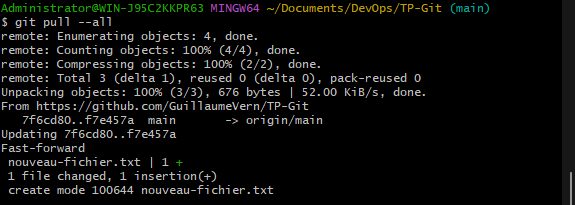

# TP-Git

## Partie 1
## Copier votre dépôt Git et ajouter des fichiers 
### Étape 1. Clonez votre dépôt dans votre système local

### Étape 2. Ajouter un fichier à votre dépôt local et le placer sur Bitbucket

la commande `git status` permet de voir les changements effectués en local.

pour indiquer a git les changements a reporter sur le repository lors du prochain commit et la branche courante, on utilise la commande `git add <file>`.
On ajoute alors le fichier indiqué à la zone de staging.

On peut ensuit commit avec la commande `git commit -m 'message de commit'`

Enfin, on push les changements sur le repository distant avec `git push origin main`

## Faites un 'pull' des changements de vôtre dépot Git sur Bitbucket Cloud 
### Étape 1. Créez un fichier dans Bitbucket 

### Étape 2. Faites un pull des changements vers un dépôt distant 

Pour cela, on utilise la commande `git pull --all`

## Utilisation d'une branche Git pour merger un fichier 
### Étape 1. Créez une branche et faites un changement 

`git branch <nom de la branche>` permet de créer une nouvelle branche
Ensuite, pour utiliser cette nouvelle branche on utilise la commande `git checkout <nom de la branche>`
Alternativement, `git checkout -b <nom de la branche>` crée une branche et nous positionne dessus automatiquement

un `git status` permet de confirmer qu'on est bien sur la nouvelle branche

Ensuite, `git add *` et `git commit -m <message>` pour commmit les changements

### Étape 2. Mergez votre branche : fast-forward merge 

depuis la branche main : `git merge future-plans`

suppression de la branche future-plans avec `git branch -d future-plans`

### Étape 3. Pushez vos changements vers Bitbucket 

avec la commande `git push origin main`.

